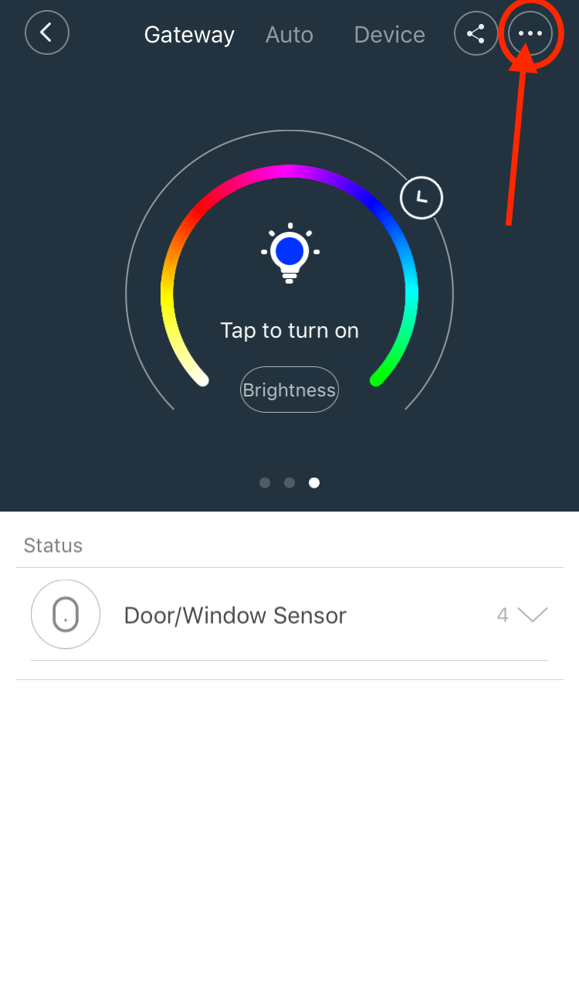
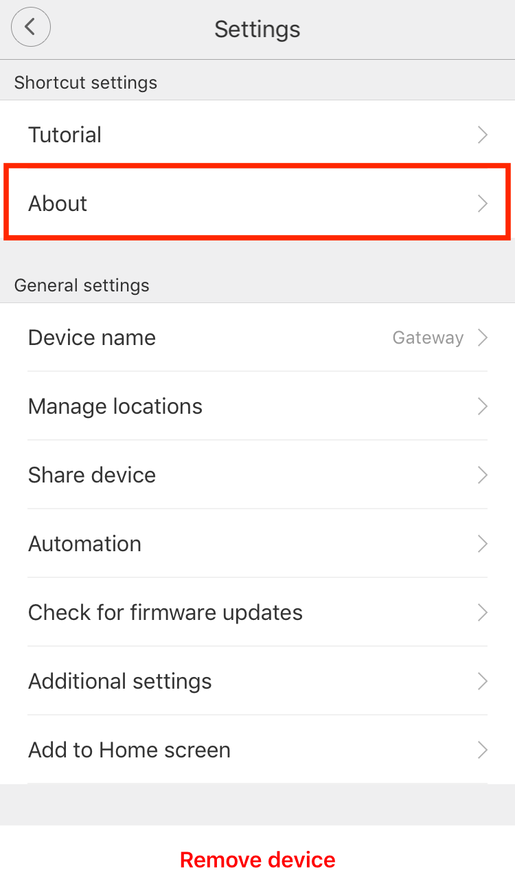
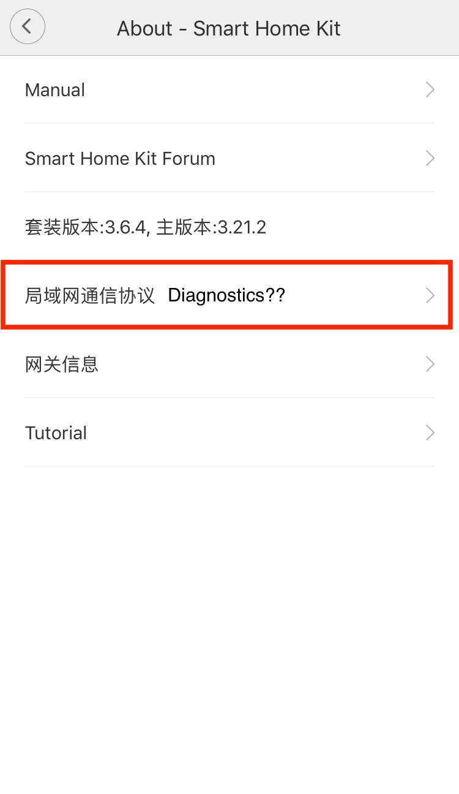
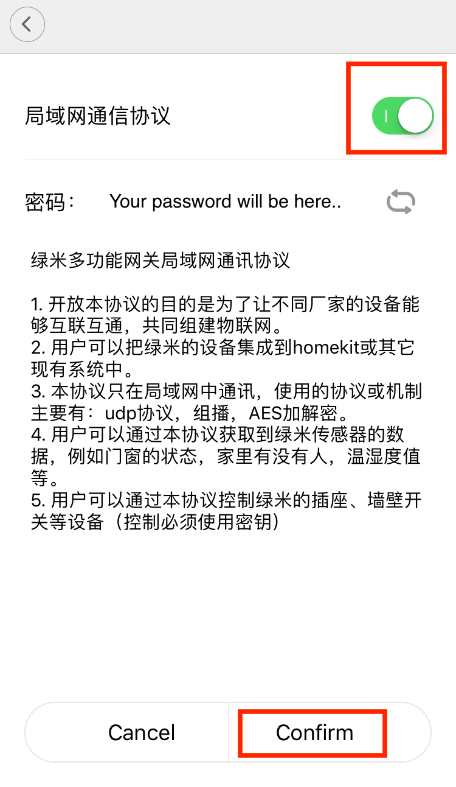

# Enable network mode on gateway
The gateway normally works with some kind off not very good translated application, but is has some sort of developer mode.

I'm not sure what it is actually called but this is the way to enable it (on iOS), there is some sort of Android manual somewhere but i cannot find it at the moment.

# Step 1

Go the the gateway screen and press the 3 dots button on top.

# Step 2

Go to the about screen

# Step 3

Press the hidden button 5 times, to enable the hidden menu (can someone translate?).

And open the new menu item (the one with the arrow).

# Step 4

Enable the first option (again don't know what is says). And click Confirm.

Return to the hidden menu and write down the password (if you want to control the gateway light.)